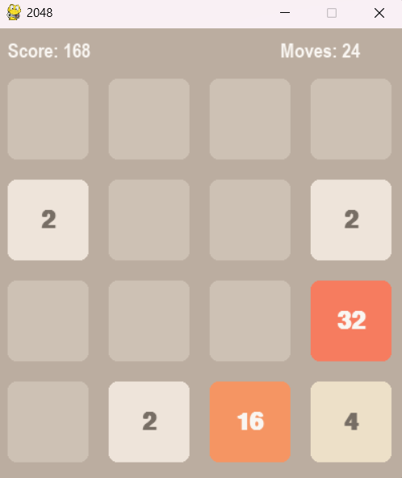

# Python Based 2048 Game

A modern implementation of the classic 2048 puzzle game built with Pygame. Challenge yourself to create the 2048 tile while enjoying features like score tracking, game statistics, and local high scores!

<div align = "center">
  
</div>

## Features
- 🎮 Smooth, responsive gameplay
- 📊 Real-time score and moves tracking
- ⏱️ Game duration monitoring
- 🏆 Local high scores system
- 💾 SQLite database for game statistics

## Requirements
- Python 3.8 or higher
- Pygame
- SQLite3 (included in Python standard library)

## Installation
1. Clone this repository:
```bash
git clone https://github.com/ajitashwathr10/2048-py.git
cd 2048-py
```

2. Install the required dependencies:
```bash
pip install pygame
```

3. Run the game:
```bash
python main.py
```

## How to Play
- Use arrow keys to move tiles (⬆️ ⬇️ ⬅️ ➡️)
- When two tiles with the same number touch, they merge into one!
- Create a tile with the number 2048 to win
- Game over when no more moves are possible

## Game Statistics
The game automatically tracks and stores:
- Your score
- Maximum tile achieved
- Number of moves
- Game duration

## Database Structure
The game uses SQLite to store two types of records:

### Games Table
- Complete game sessions
- Includes score, max tile, duration, and moves
<div align = "center">
  
</div>

## Contributing
Feel free to contribute to this project! You can:
1. Fork the repository
2. Create your feature branch (`git checkout -b feature/AmazingFeature`)
3. Commit your changes (`git commit -m 'Add some AmazingFeature'`)
4. Push to the branch (`git push origin feature/AmazingFeature`)
5. Open a Pull Request

## Acknowledgments
- Original 2048 game by Gabriele Cirulli
- Pygame community for the excellent game development library
- Contributors and testers who helped improve this implementation
